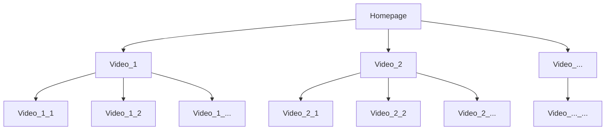

# ▶️ **Youtube Video Metadata Scraping**

Faiz Muhammad Kautsar (5054231013)  
Shalahuddin Ahmad Cahyoga (5054231014)

[EN](#-what) | [ID](#-apa)

## ❓ **What**

[ID](#-apa)

This repository, or, well, at least this folder, contains the first week assignment of the Data Mining course of Faiz and Addin.

## 🗒️ **Description**

The dataset is comprised of two JSON-formatted sets, scraped off Youtube with undetected-chromedriver. No post-processing has been done to it. Used were personal accounts of Faiz and Addin to obtain the curated feed.

`...3013ed129353.json` contains our initial attempt for a larger-scale scrape, although we didn't extract as much information there, it contains the description, hrefs, and titles of 1421 videos along with the likes on each of them.

The `...8544a64d571d.json` set is our latest iteration with more selectors and a more comprehensive scrape. It contains the metadata of 1409 videos, described by the following fields:

1. title: The title of the video
2. desc: The description of the video
3. likes: The number of likes on the video
4. duration: The duration of the video
5. channelName: The channel name of the uploader
6. subCount: The subscriber count of the uploader
7. dateAndViews: The views and date of upload

## 🤖 **Scraper**

Our scraper is based on undetected-chromedriver, which itself wraps selenium. The reasoning for this is because my (Faiz) personal browser is Brave, and selenium's default chromedriver doesn't play nice with it.

To run, you can copy `.env.example` to `.env` and fill it in with your environment's variables. You can obtain both of the variables in `chrome://`version if you're working with Chrome, and `brave://version` if you're working with Brave.

The scraper works in a Depth-Limited Search (DLS) manner, starting with the homepage and grabbing all of the recommendations that follows after you click on each of them. So, i.e.,

(assuming depth of 1, we're working with depth of 2 for the current configuration)

## 😦 **Caveats/Appendix**

As said before, no post-processing steps' been done on the scrape. This means some malformations do exist on the set, although due to the scale, we believe that for the most part, the data is relatively clean.

Some notable malformations after a few brief glances through the set:

1. The `likes` selector misses sometimes, this is due to the fact that Youtube has added this animated like feature that screws with the actual HTML that's sent to the browser, i.e. the numbers scroll when you tap on the button and this is achieved by having the numbers actually be on the HTML. This resulted in the `0123456789` artifacts.
2. `dateAndViews` sometimes also contain hashtags, this is because our selector grabs the general row of that information instead of selecting them individually, which itself is because of the inconsistencies in length when the number of items don't add up, i.e., when hashtags are there.

---

## ❓ **Apa**

[EN](#-what)

Folder ini berisi hasil tugas minggu pertama Data Mining Faiz dan Addin.

## 🗒️ **Deskripsi**

<!-- todo -->
